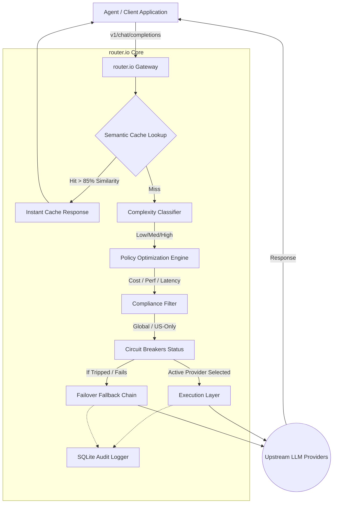
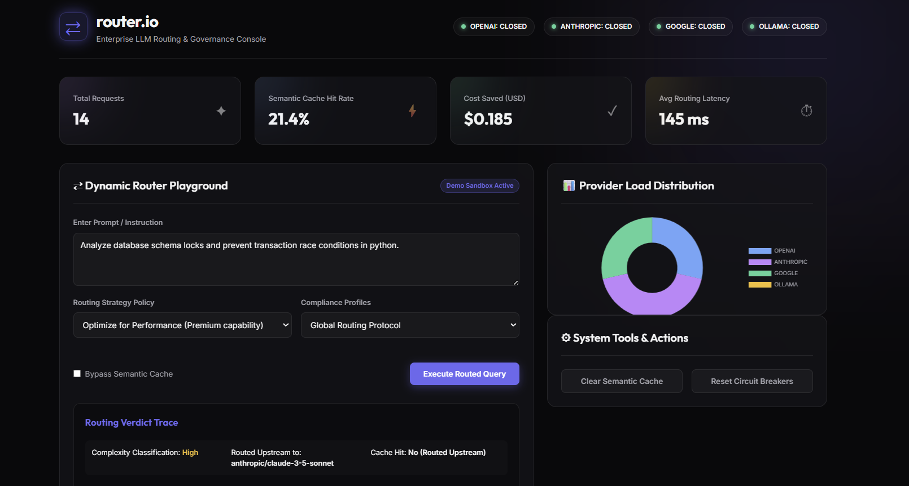

# ⇄ router.io — Enterprise Multi-Vendor LLM Gateway & Routing Engine

`routerio` is an intelligent, high-performance, and resilient LLM routing gateway designed to sit between enterprise applications/agents and upstream model providers (Anthropic, OpenAI, Google Gemini, and local Ollama). 

Exposing a unified, **OpenAI-compatible `/v1/chat/completions` API**, `routerio` automatically optimizes model selection in real-time based on prompt complexity, user policies (cost, performance, or latency), data compliance parameters, and active upstream health monitoring.

---

## 🚀 Core Features

- **🧠 Dynamic Complexity Analysis**: Inspects incoming prompts for lexical triggers, token density, and structural code syntax to classify task complexity (Low, Medium, High).
- **📈 Multi-Policy Optimization**:
  - `cost`: Heavily favors cheaper tiers (e.g., Google Gemini 2.5 Flash, GPT-4o-Mini) when task requirements allow, slashing LLM spend by up to 90%.
  - `performance`: Routes directly to premier models (e.g., Anthropic Claude 3.5 Sonnet, OpenAI GPT-4o).
  - `latency`: Picks the fastest responding model in the target tier.
- **⚡ Dependency-Free Semantic Cache**: Features an elegant, local, mathematical Cosine Similarity lookup that matches incoming queries with previous answers, returning instant hits with **0ms latency and $0.00 spend**.
- **🔌 Circuit Breaker Pattern**: Continuously monitors upstream status. If a provider fails 3 consecutive times, its circuit trips (`OPEN`) for 60 seconds, preventing user latency spikes by skipping the provider instantly.
- **🛡 Fallback & Recovery Chains**: Executes deep fallback pipelines automatically if an active model encounters timeout, invalid API keys, or provider rate limits.
- **📊 Real-Time Governance Dashboard**: A beautifully designed, dark-mode visual interface with radial ambient glow and frosted glassmorphism that showcases real-time throughput metrics, cost savings, load distribution charts, and live playground traces.

---

## 📐 Architecture



---

## 📊 Governance Console UI

The gateway ships with a beautifully designed, dark-mode visual interface with radial ambient glow and frosted glassmorphism that showcases real-time throughput metrics, cost savings, load distribution charts, and live playground traces.



---

## 🛠 Tech Stack

- **Backend Framework**: Python 3.11+, FastAPI, Uvicorn
- **Upstream Integrations**: OpenAI, Anthropic, Google Generative AI, Ollama
- **Persistence**: SQLite (Audit logging, Circuit States, and Cache)
- **Analytics Visualization**: Chart.js (Interactive loaded load distributions)
- **Design Aesthetic**: Premium glassmorphic custom dark theme (HTML5, Vanilla CSS3, Javascript ES6)


## ⚙ Installation & Quickstart

### 1. Clone & Navigate
```bash
git clone https://github.com/mailtotanvir/routerio.git
cd routerio
```

### 2. Configure Environment Variables
Create a `.env` file in the root directory:
```env
# Optional API Keys (If absent, router.io runs in Simulated Provider Mode for local demonstration)
OPENAI_API_KEY=your_openai_key
ANTHROPIC_API_KEY=your_anthropic_key
GEMINI_API_KEY=your_gemini_key
OLLAMA_BASE_URL=http://localhost:11434

# Routing Configurations
CACHE_SIMILARITY_THRESHOLD=0.85
MOCK_MODE_BY_DEFAULT=false
```

### 3. Install Dependencies
```bash
pip install -r requirements.txt
```

### 4. Run the Server
```bash
uvicorn main:app --reload --port 8000
```
Open your browser and navigate to **`http://localhost:8000`** to access the visual dashboard!

---

## 🔌 API Reference (OpenAI-Compatible)

`routerio` can drop directly into any existing python/js script by swapping the API base url:

```python
import openai

# Drop-in replacement pointing to your routed gateway
client = openai.OpenAI(
    api_key="routerio_poc_key_2026", # any placeholder string
    base_url="http://localhost:8000/v1"
)

response = client.chat.completions.create(
    model="routerio-intelligent-router", # default routed endpoint
    messages=[{"role": "user", "content": "Analyze the performance bottleneck in nested loops."}],
    extra_body={
        "policy": "cost",       # Options: 'cost', 'performance', 'latency'
        "compliance": "global"  # Options: 'global', 'us-only'
    }
)

print(response.choices[0].message.content)
```

---

## 🧪 Verification & Unit Testing

A comprehensive verification test suite is supplied to programmatically test the routing system. Run the tests using the command below:

```bash
python -m unittest test_router.py
```

Expected output:
```text
.....
----------------------------------------------------------------------
Ran 5 tests in 0.521s

OK
```

---

## 📄 License
This project is open-source and licensed under the MIT License.
